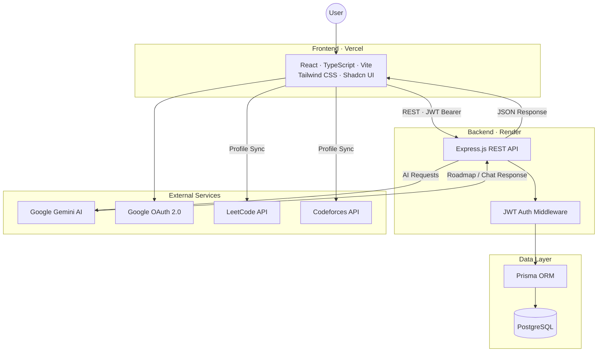
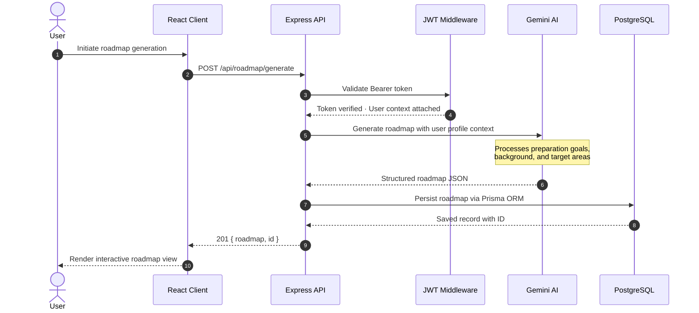

<div align="center">

<h1>Navixo</h1>

<p><em>Placement preparation is not an information problem. It is an execution problem.</em></p>

<p>Navixo is a placement execution engine that helps engineering students move from planning to consistent execution through —<br />personalized roadmaps, progress tracking, coding profile integrations, and structured preparation workflows.</p>

<br />

<p>
  
  
  
  
  
  
</p>

<p>
  <a href="https://navixo.site"></a>
  
</p>

<br />

<p>
  <a href="https://navixo.site">
    
  </a>
  &nbsp;
  <a href="https://github.com/Askme007/Navixo/issues/new?labels=bug">
    
  </a>
  &nbsp;
  <a href="https://github.com/Askme007/Navixo/issues/new?labels=enhancement">
    
  </a>
</p>

<br />

<p>
  <a href="#overview">Overview</a> &nbsp;·&nbsp;
  <a href="#features">Features</a> &nbsp;·&nbsp;
  <a href="#architecture">Architecture</a> &nbsp;·&nbsp;
  <a href="#screenshots">Screenshots</a> &nbsp;·&nbsp;
  <a href="#tech-stack">Tech Stack</a> &nbsp;·&nbsp;
  <a href="#getting-started">Getting Started</a> &nbsp;·&nbsp;
  <a href="#environment-variables">Environment</a> &nbsp;·&nbsp;
  <a href="#roadmap">Roadmap</a> &nbsp;·&nbsp;
  <a href="#contributors">Contributors</a>
</p>

<br />


</div>

---

## Overview

Most engineering students approaching placement season have access to the same resources — LeetCode grind lists, YouTube playlists, blog roadmaps, and PDF guides. The information is abundant. The problem has never been access.

The real bottleneck is **execution** — showing up consistently, knowing what to do *today*, and being able to measure whether you're actually getting closer to placement-ready.

Navixo is built around this distinction. It is not a resource aggregator or a course platform. Navixo is an **AI-powered execution layer** — a focused workspace that translates preparation intent into structured, trackable daily action.
  
### The Problem

| Challenge | What actually happens |
|---|---|
| **Resource overload** | Dozens of DSA sheets, conflicting roadmaps, no clear path for your specific background |
| **No execution system** | You know what to study but have no structure for *how* to study it daily |
| **Fragmented tools** | LeetCode stats here, notes in Notion, roadmaps in a doc, Codeforces in another tab |
| **No mentor access** | Most students prepare without any personalised guidance or feedback loop |
| **No visibility** | You don't know whether this week's effort actually moved the needle |

### What Navixo Does

Navixo gives every engineering student access to a structured preparation system — one that generates a personalised roadmap based on their background, tracks execution at the task and milestone level, syncs real-time data from their coding profiles, and provides an AI mentor to unblock them when they're stuck.

---

## Features

### Planning

| Feature | Description |
|---|---|
| **Personalised Onboarding** | Captures preparation background, goals, target companies, and current skill level to calibrate the experience |
| **AI Roadmap Generation** | Produces structured preparation roadmaps across DSA, Core CS, Development, and Placement Prep — driven by Google Gemini |
| **Roadmap Persistence** | All generated roadmaps are stored and accessible across sessions and devices |

### Execution

| Feature | Description |
|---|---|
| **Execution Dashboard** | Central view of active roadmaps, completed milestones, current focus areas, and progress percentages |
| **Progress Tracking** | Topic-level and milestone-level execution logging with completion states |
| **Platform Statistics** | Aggregated view of coding activity from all connected profiles |

### Intelligence

| Feature | Description |
|---|---|
| **AI Mentor Chat** | Conversational interface powered by Gemini for roadmap clarification, concept explanation, and study guidance |
| **Persistent Conversations** | Full chat history is preserved across sessions — pick up where you left off |

### Integrations

| Feature | Description |
|---|---|
| **LeetCode Sync** | Connect your LeetCode profile to surface problems solved, difficulty breakdown, and ranking data |
| **Codeforces Sync** | Connect your Codeforces account to track rating history and competitive programming activity |

### Authentication

| Feature | Description |
|---|---|
| **Email & Password** | Standard credential-based authentication with secure password handling |
| **Google OAuth 2.0** | One-click sign-in with Google |
| **JWT Architecture** | Separate access and refresh token lifecycle for secure, stateless API authorisation |

---

## Architecture

### System Overview



### Roadmap Generation Flow



---

## Screenshots

### Landing Page


<br />

### Execution Dashboard


<br />

### Roadmap View


<br />

### AI Chat Workspace


---

## Tech Stack

<table>
<tr>
<td valign="top" width="50%">

**Frontend**


**Authentication**


</td>
<td valign="top" width="50%">

**Backend**


**Database**


**AI & Deployment**


</td>
</tr>
</table>

---

## Getting Started

### Prerequisites

- **Node.js** v18 or higher
- **PostgreSQL** database — local, or a hosted provider (Neon, Supabase, or Railway)
- **Google Cloud project** with OAuth 2.0 credentials configured
- **Google Gemini API key** from [Google AI Studio](https://aistudio.google.com)

### 1. Clone the repository

```bash
git clone https://github.com/Askme007/Navixo.git
cd Navixo
```

### 2. Frontend setup

```bash
# Install dependencies
npm install

# Copy environment template
cp .env.example .env.local

# Add your environment variables — see Environment Variables below

# Start the development server
npm run dev
```

The frontend runs at `http://localhost:5173` by default.

### 3. Backend setup

```bash
cd backend

# Install dependencies
npm install

# Copy environment template
cp .env.example .env

# Add your environment variables — see Environment Variables below

# Run database migrations
npx prisma migrate dev

# Generate Prisma client
npx prisma generate

# Start the server
npm run dev
```

The API server runs at `http://localhost:8080` by default.

---

## Environment Variables

### Frontend

| Variable | Description | Example |
|---|---|---|
| `VITE_API_URL` | Base URL of the backend API | `https://api.navixo.site` |
| `VITE_API_BASE_URL` | Alternate API base URL for prefixed routes | `https://api.navixo.site/api` |
| `VITE_GOOGLE_CLIENT_ID` | Google OAuth 2.0 Client ID | `123456789.apps.googleusercontent.com` |

### Backend

| Variable | Description | Notes |
|---|---|---|
| `DATABASE_URL` | Pooled PostgreSQL connection string | Used for runtime queries |
| `DIRECT_URL` | Direct PostgreSQL connection string | Used by Prisma for migrations |
| `JWT_SECRET` | Master JWT signing secret | Use a strong random value |
| `JWT_ACCESS_SECRET` | Access token signing secret | Short-lived tokens |
| `JWT_REFRESH_SECRET` | Refresh token signing secret | Long-lived tokens |
| `GEMINI_API_KEY` | Google Gemini API key | From Google AI Studio |
| `GOOGLE_CLIENT_ID` | Google OAuth 2.0 Client ID | |
| `GOOGLE_CLIENT_SECRET` | Google OAuth 2.0 Client Secret | |
| `PORT` | Server port | `8080` |
| `NODE_ENV` | Environment mode | `development` or `production` |

---

## Project Structure

```
Navixo/
│
├── src/                          # Frontend source
│   ├── components/
│   │   ├── dashboard/            # Dashboard widgets and analytics panels
│   │   ├── chat/                 # AI chat workspace components
│   │   ├── Markdown/             # Markdown rendering utilities
│   │   └── ui/                   # Shadcn UI base component library
│   │
│   ├── hooks/                    # Custom React hooks
│   ├── services/                 # API service layer (axios/fetch wrappers)
│   ├── utils/                    # Shared utility functions
│   └── router.tsx                # Application route definitions
│
├── backend/
│   └── src/
│       ├── controllers/          # Route handler logic
│       ├── routes/               # Express route definitions
│       ├── services/             # Business logic and external integrations
│       ├── middleware/           # Auth validation, error handling
│       └── config/               # Environment config and app constants
│
└── prisma/
    └── schema.prisma             # Database schema definitions
```

---

## Roadmap

Navixo is under active development. The following capabilities are planned:

**Shipped**
- [x] Personalised onboarding workflow
- [x] AI-generated preparation roadmaps (Gemini)
- [x] Execution dashboard with progress tracking
- [x] LeetCode and Codeforces profile sync
- [x] AI mentor chat with persistent history
- [x] Google OAuth and JWT authentication
- [x] Responsive web interface

**Upcoming**
- [ ] Advanced execution analytics and trend visualisation
- [ ] Resume analyser with AI-generated feedback
- [ ] Interview preparation module with curated question banks
- [ ] Mock interview system with AI evaluation
- [ ] Daily execution reports and accountability nudges
- [ ] Placement analytics — offer tracking, company-wise preparation stats
- [ ] Mobile application

---

## Contributing

Contributions, bug reports, and feature requests are welcome.

Before submitting a pull request for a significant change, please open an issue first to discuss the proposed change and confirm it aligns with the project direction.

```bash
# 1. Fork the repository
# 2. Create a feature branch
git checkout -b feature/your-feature-name

# 3. Commit your changes
git commit -m "feat: describe your change"

# 4. Push to your fork
git push origin feature/your-feature-name

# 5. Open a pull request against main
```

Please keep commits focused and pull requests scoped to a single concern.

---

## Contributors

<table>
<tr>
  <td align="center">
    <a href="https://github.com/Askme007">
      <br />
      <sub><b>Ashkrit Rai</b></sub>
    </a>
  </td>
  <td align="center">
    <a href="https://github.com/akabhi2311">
      <br />
      <sub><b>Abhishek Kumar</b></sub>
    </a>
  </td>
</tr>
</table>

---

## Support

| Channel | Purpose |
|---|---|
| [GitHub Issues](https://github.com/Askme007/Navixo/issues) | Bug reports and reproducible problems |
| [GitHub Issues](https://github.com/Askme007/Navixo/issues) | Feature requests — use the `enhancement` label |

When filing a bug report, please include your browser, Node.js version, and steps to reproduce the issue.

---

## License

This project is proprietary software.
Source code is provided for portfolio and demonstration purposes only.
No part of this repository may be copied, redistributed, modified, or used commercially without explicit written permission from the authors.

All rights reserved © 2026 Ashkrit Rai, Abhishek Kumar.

---

<div align="center">
  <sub>Built with focus. Shipped with purpose.</sub>
</div>
